VMA Win
=======

Last update: 1997

VMAWin is a Borland Pascal library intended to implement GUI (Windows like) interfaces under DOS.

The VMAWin library has been used in the following two educational titles, also present on GitHub:

- [Physics](https://github.com/mveteanu/Physics)
- [Mecano](https://github.com/mveteanu/Mecano)

Features
--------

- SVGA support
- .BMP image support
- mouse support
- object-oriented design

Screencast
----------

- [http://www.vmasoft.net/vmawin.html](http://www.vmasoft.net/vmawin.html)

Screenshots
-----------

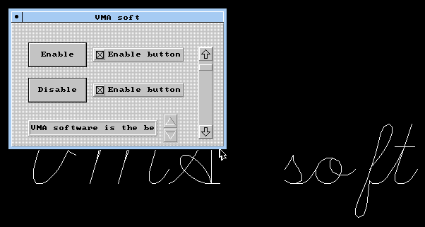
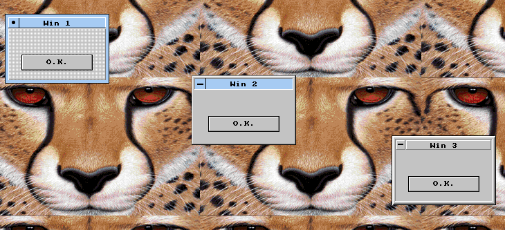
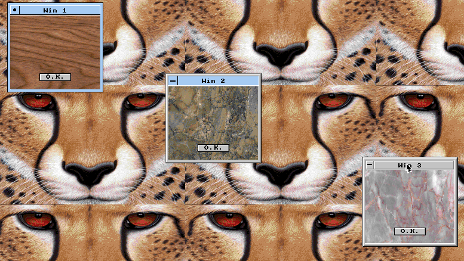
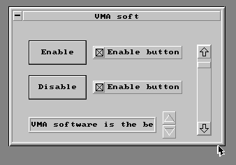
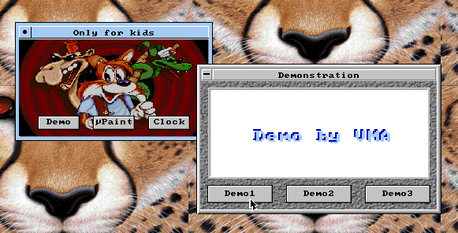
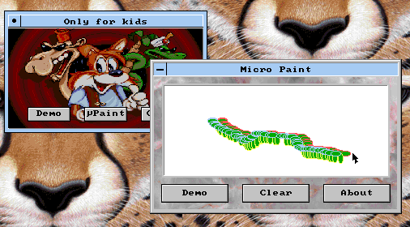
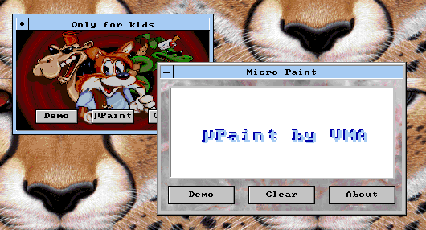
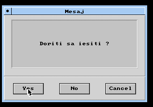
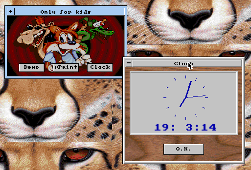
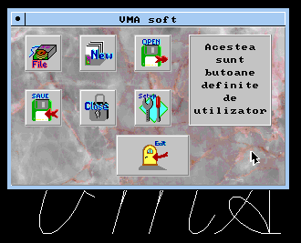
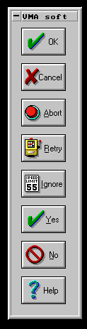
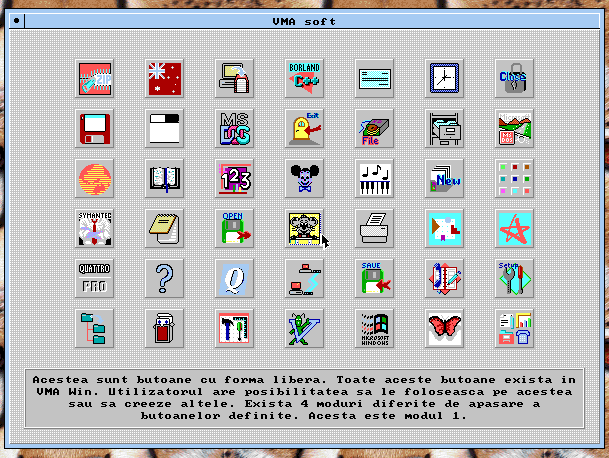
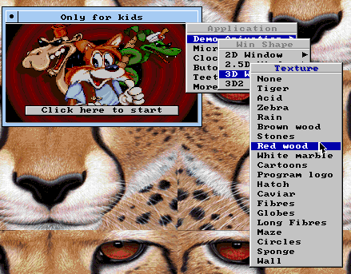
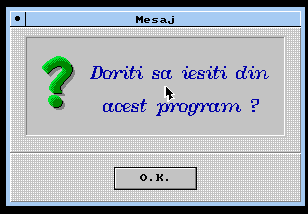
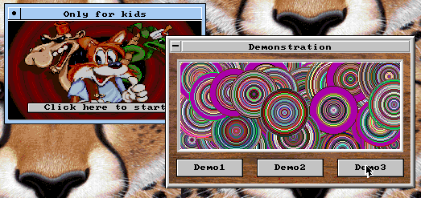
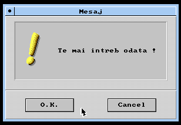
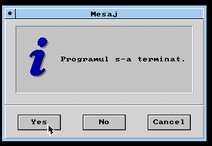
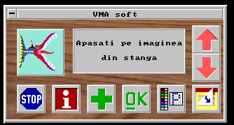
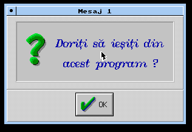
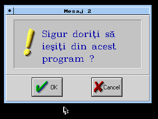
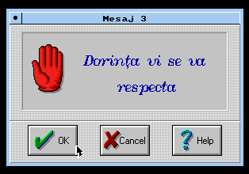
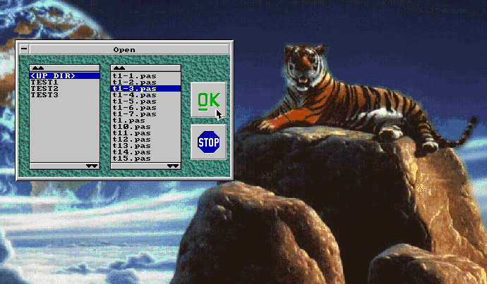
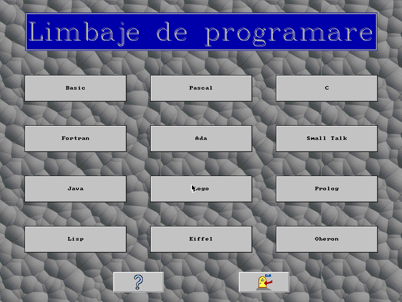
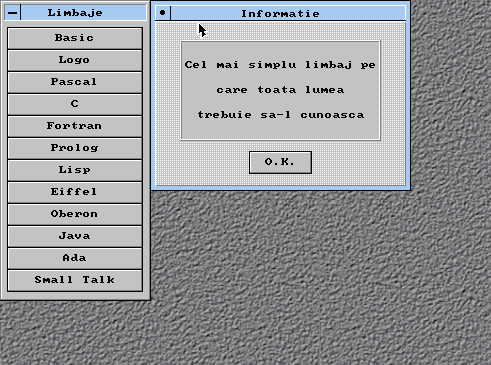
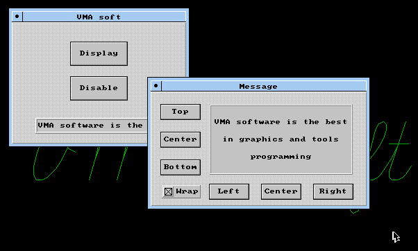
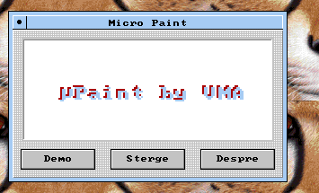
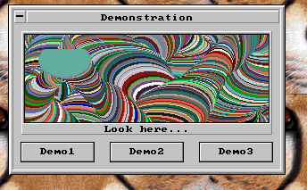
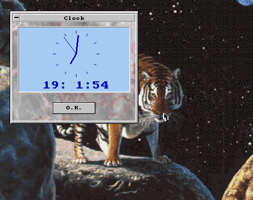

Note: Library includes also a modified version of [MCGA library](https://github.com/mveteanu/MCGA) for cases when is desired to embedd MCGA graphics in VMA Win windows.

