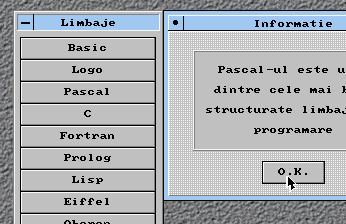
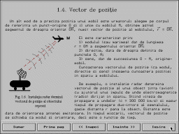
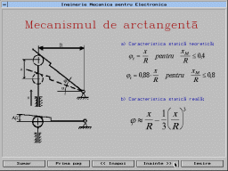

VMA Win
=======

Last update: 1997

VMA Win is a Borland Pascal library intended to implement GUI (Windows like) interfaces under DOS.

Features
--------

- SVGA support
- .BMP image support
- mouse support
- object-oriented design

VMA
