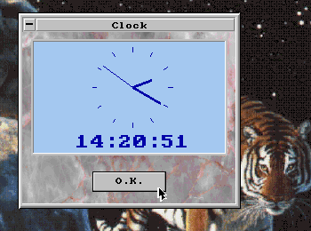

VMA Win
=======

Last update: 1997

VMA Win is a Borland Pascal library intended to implement GUI (Windows like) interfaces under DOS.

Features
--------

- SVGA support
- .BMP image support
- mouse support
- object-oriented design

Note: Library includes also a modified version of [MCGA library](https://github.com/mveteanu/MCGA) for cases when is desired to embedd MCGA graphics in VMA Win windows.

VMA
